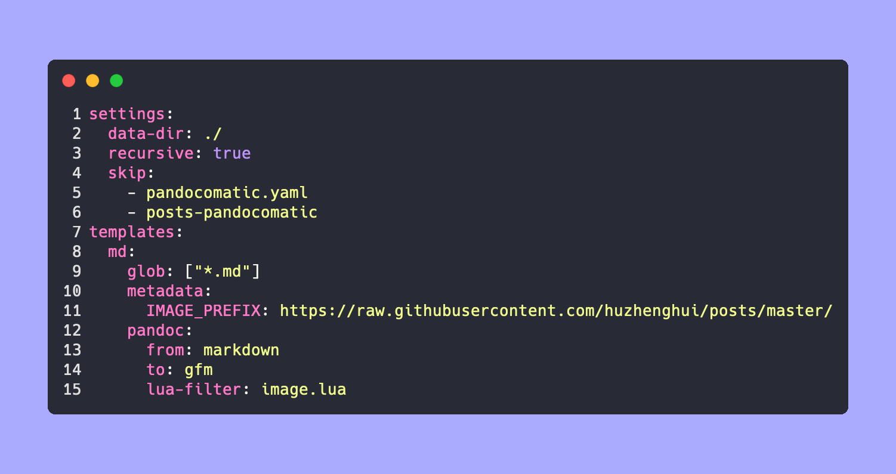

<!-- markdownlint-disable-next-line MD025 -->
# 使用`GitHub`作为`Markdown`图床

## 目录

- [使用`GitHub`作为`Markdown`图床](#使用github作为markdown图床)
    - [目录](#目录)
    - [简介](#简介)
    - [仓库](#仓库)
        - [`xuekaiyuan-com/xuekaiyuan-com.github.io`仓库](#xuekaiyuan-comxuekaiyuan-comgithubio仓库)
        - [`huzhenghui/posts`仓库](#huzhenghuiposts仓库)
        - [`huzhenghui/posts-pandocomatic`](#huzhenghuiposts-pandocomatic)
    - [Pandoc](#pandoc)
    - [Lua](#lua)
    - [pandocomatic](#pandocomatic)

## 简介

本文讲解如何使用`GitHub Actions`将`Markdown`文件中图片的相对路径转换为绝对路径，
后续将`Markdown`文件复制到其他位置可以保持图片链接地址，也就是使用`GitHub`作为`Markdown`图床。

目前网站已发布在

<https://www.xuekaiyuan.com/>

已经同步发布在

<https://xuekaiyuan.pages.dev/>

<https://xuekaiyuan.netlify.app>

本文发表在

<https://www.xuekaiyuan.com/huzhenghui/pandocomatic/readme.textbundle/>

<https://xuekaiyuan.pages.dev/huzhenghui/pandocomatic/readme.textbundle/>

<https://xuekaiyuan.netlify.app/huzhenghui/pandocomatic/readme.textbundle/>

## 仓库

### `xuekaiyuan-com/xuekaiyuan-com.github.io`仓库

仓库位于<https://github.com/xuekaiyuan-com/xuekaiyuan-com.github.io/>

相关版本为

[v0.3](https://github.com/xuekaiyuan-com/xuekaiyuan-com.github.io/tree/v0.3)

详见<https://www.xuekaiyuan.com/posts/xuekaiyuan/readme/>

### `huzhenghui/posts`仓库

仓库位于<https://github.com/huzhenghui/posts>

- [v0.1](https://github.com/huzhenghui/posts/tree/v0.1)
    - 实现了自动触发更新<https://www.xuekaiyuan.com/>
- [v0.2](https://github.com/huzhenghui/posts/tree/v0.2)
    - 网站同步发布在<https://xuekaiyuan.pages.dev/>
- [v0.3](https://github.com/huzhenghui/posts/tree/v0.3)
    - 网站同步发布在<https://xuekaiyuan.netlify.app/>

本文将使用`GitHub Actions`将`Markdown`文件中图片的相对路径转换为绝对路径，
转换目标为[`huzhenghui/posts-pandocomatic`](#huzhenghuiposts-pandocomatic)。

相关版本为

### `huzhenghui/posts-pandocomatic`

<https://github.com/huzhenghui/posts-pandocomatic>

## Pandoc

## Lua

## pandocomatic

